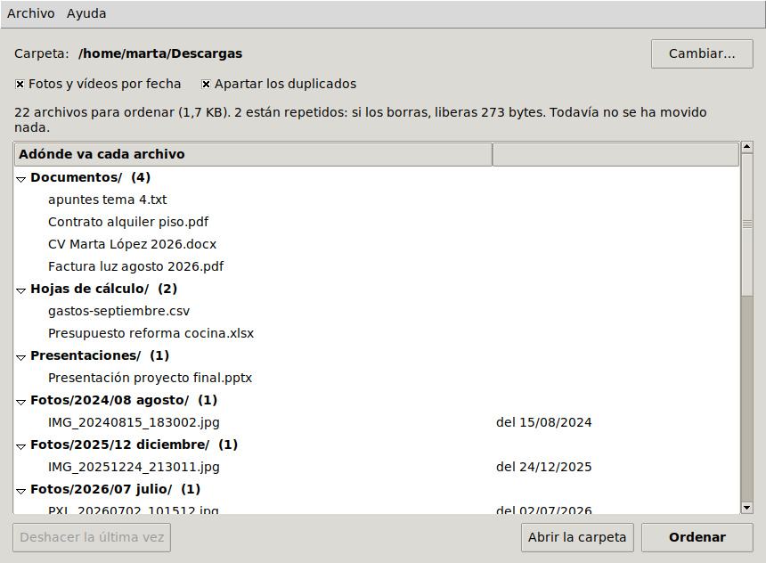

# ordena

[](https://github.com/espi0207/ordena/actions/workflows/ci.yml)
[](https://github.com/espi0207/ordena/actions/workflows/release.yml)

Pone orden en la carpeta de Descargas, o en cualquier otra. Mete cada archivo en una
subcarpeta según su tipo, las fotos y los vídeos por la fecha en que se hicieron y los
repetidos aparte. Antes de mover nada te enseña lo que va a hacer, no borra nunca nada y
se puede deshacer.



## Descargar

| Sistema | |
|---|---|
| **Windows** 10 y 11 | [Instalador (ordena-windows.exe)](https://github.com/espi0207/ordena/releases/latest/download/ordena-windows.exe) |
| **macOS** 11 o posterior, con chip de Apple | [ordena-mac.dmg](https://github.com/espi0207/ordena/releases/latest/download/ordena-mac.dmg) |
| **Linux** (Ubuntu, Debian, Mint...) | [ordena-linux.deb](https://github.com/espi0207/ordena/releases/latest/download/ordena-linux.deb) |

No están firmados, porque firmar cuesta dinero cada año. Por eso la primera vez el
sistema avisa:

- **Windows** dice "Windows protegió su PC". Pulsa *Más información* y luego *Ejecutar
  de todas formas*. El instalador puede añadir **Ordenar con ordena** al menú del clic
  derecho de las carpetas (en Windows 11, dentro de *Mostrar más opciones*).
- **macOS**: arrastra ordena a Aplicaciones y ábrelo. Dirá que no puede comprobar si es
  seguro; ve a *Ajustes del Sistema > Privacidad y seguridad*, baja hasta el aviso de
  ordena y pulsa *Abrir igualmente*. Solo hace falta una vez. (Si en vez de eso dijera
  que la app "está dañada", en la Terminal: `xattr -dr com.apple.quarantine
  /Applications/ordena.app`.)
- **Linux**: `sudo apt install ./ordena-linux.deb`. Sale en el menú de aplicaciones, y
  en la terminal como `ordena`.

Para probarlo sin miedo: *Archivo > Probar con una carpeta de ejemplo* crea una carpeta
de Descargas de mentira para ordenarla y deshacerlo.

Los tres se construyen y se prueban en GitHub Actions: la CI instala cada uno, lo abre
con una carpeta de ejemplo, la ordena, lo deshace y comprueba que todo vuelve a estar
como estaba.

## En la terminal

Lo mismo sin ventana, para quien lo prefiera o para programarlo. Con Python 3.10 o más
nuevo (no usa ninguna librería):

```bash
pipx install git+https://github.com/espi0207/ordena
```

```text
$ ordena
Carpeta: /home/marta/Descargas
22 archivos para ordenar (1,7 KB):

  Documentos            4
  Hojas de cálculo      2
  Presentaciones        1
  Fotos/2024            1
  Fotos/2025            1
  Fotos/2026            1
  Imágenes              2
  Vídeos/2025           1
  Vídeos                1
  Música                1
  Comprimidos           1
  Instaladores          2
  Libros                1
  Otros                 1
  Duplicados            2   si los borras, liberas 273 bytes

Se quedan donde están (2): 1 oculto o del sistema, 1 descarga a medias

Esto es solo el plan: no se ha movido nada.
Para ver adónde va cada archivo:  ordena --detalle
Para ordenarla de verdad:         ordena --aplicar
```

(Es la carpeta de ejemplo que crea `ordena --demo`: sus archivos son de relleno y por eso
pesan tan poco.)

Con `--aplicar` queda así:

```text
Descargas/
├── Comprimidos/
│   └── fotos-boda-ana-y-luis.zip
├── Documentos/
│   ├── apuntes tema 4.txt
│   ├── Contrato alquiler piso.pdf
│   ├── CV Marta López 2026.docx
│   └── Factura luz agosto 2026.pdf
├── Duplicados/
│   ├── CV Marta López 2026 (1).docx
│   └── IMG_20240815_183002 (1).jpg
├── Fotos/
│   ├── 2024/
│   │   └── 08 agosto/
│   │       └── IMG_20240815_183002.jpg
│   ├── 2025/
│   │   └── 12 diciembre/
│   │       └── IMG_20251224_213011.jpg
│   └── 2026/
│       └── 07 julio/
│           └── PXL_20260702_101512.jpg
├── Hojas de cálculo/
│   ├── gastos-septiembre.csv
│   └── Presupuesto reforma cocina.xlsx
├── Imágenes/
│   ├── Captura de pantalla 2026-09-20 114207.png
│   └── meme-lunes.webp
├── Instaladores/
│   ├── vlc-3.0.21-win64.exe
│   └── zoom_amd64.deb
├── ...
├── Vídeos/
│   ├── 2025/
│   │   └── 06 junio/
│   │       └── VID_20250614_120501.mp4
│   └── tutorial excel tablas dinámicas.mkv
├── desktop.ini
└── temporada 2 capítulo 3.mkv.crdownload
```

Y si no te gusta, `ordena --deshacer` lo deja todo como estaba.

### Uso

```bash
ordena                  # el plan para tu carpeta de Descargas, sin tocar nada
ordena --detalle        # lo mismo, archivo por archivo
ordena --aplicar        # hacerlo
ordena --deshacer       # dejarlo como estaba antes de la última vez

ordena ~/Escritorio     # otra carpeta (vale con todas las opciones de arriba)
ordena --demo           # crea una carpeta de prueba para trastear sin miedo
```

Si no le dices carpeta, busca la de Descargas: `~/Downloads` en Windows y macOS, y en
Linux la que diga `xdg-user-dirs`, que en un sistema en español suele ser `~/Descargas`.

Opciones:

- `--sin-fechas`: las fotos y los vídeos van todos juntos a `Imágenes` y `Vídeos`.
- `--sin-duplicados`: no busca archivos repetidos.

## Qué hace exactamente

**Por tipo**, según la extensión: Documentos, Hojas de cálculo, Presentaciones,
Imágenes, Vídeos, Música, Comprimidos, Instaladores, Libros, Código, Tipografías y, lo
que no encaje, Otros. La lista está al principio de
[`organizer.py`](ordena/organizer.py) y es fácil de cambiar.

**Fotos y vídeos por fecha**, en carpetas como `Fotos/2024/08 agosto` (con el número
delante para que los meses salgan en orden). La fecha no es la del archivo, que al
descargar una foto o pasarla del móvil al ordenador se convierte en la de hoy. Es la
que va guardada dentro:

- JPEG: la etiqueta DateTimeOriginal del EXIF, la que pone la cámara al hacer la foto.
- HEIC (las fotos del iPhone): el mismo EXIF, pero dentro de un contenedor del estilo de
  los MP4. Las tablas del principio del archivo dicen dónde está, y puede estar al final:
  en una foto de 13 MB guardada con libheif estaba a 13 MB del principio. Así que se leen
  las tablas y se salta directamente allí.
- MP4 y MOV: la fecha de creación de la cabecera `mvhd`, que va en UTC y se pasa a la
  hora del ordenador.

Todo esto se lee a mano con `struct`, sin Pillow ni ffmpeg. Lo que no tiene fecha
dentro (capturas de pantalla, fotos que han pasado por WhatsApp) va a `Imágenes` o a
`Vídeos`, sin año.

**Duplicados.** Los archivos con el mismo contenido, aunque se llamen distinto, van a
`Duplicados`, y te dice cuánto espacio ganarías borrándolos. Borrarlos es cosa tuya:
ordena no borra nada. De cada grupo de iguales, uno se ordena como cualquier otro archivo:
el que no tiene pinta de copia (`foto (1).jpg`, `informe - copia.pdf`,
`Copia de presupuesto.xlsx`...) o, si ninguno la tiene, el más antiguo. Para no leer la
carpeta entera, primero se agrupan por tamaño y solo se calcula el SHA-256 de los que
miden lo mismo.

**Lo que no toca:**

- Las descargas a medias (`.crdownload`, `.part`, `.download`...). Si se mueven, el
  navegador pierde la pista y la descarga se estropea.
- Los archivos ocultos y los del sistema (`desktop.ini`, `Thumbs.db`, `.DS_Store`).
- Las carpetas que ya tengas. Solo ordena los archivos sueltos.
- Las carpetas del sistema, tu carpeta personal entera y los proyectos de git: con esas
  se niega, por si te equivocas al escribir la ruta.

## Por qué te puedes fiar

Es un programa que mueve tus archivos, así que lo importante es que no pueda perder
ninguno:

- **Nunca sobrescribe.** Si en `Documentos` ya hay un `informe.pdf`, el nuevo se queda
  como `informe (2).pdf`. Y no basta con comprobarlo antes de mover, porque entre la
  comprobación y el movimiento otro programa podría crear ese archivo. En Linux y macOS
  se mueve con un enlace duro, que el propio sistema se niega a crear si el nombre ya
  existe, y luego se quita el original. En Windows, `rename` ya se niega a pisar. En los
  USB con FAT, que no tienen enlaces duros, se comprueba y se renombra.
- **Todo queda apuntado.** Cada archivo movido se escribe en `.ordena-historial.jsonl`
  (dentro de la misma carpeta) nada más moverlo. Si el programa se corta a mitad,
  `--deshacer` sabe hasta dónde llegó.
- **Deshacer no pisa nada tampoco.** Si mientras tanto has descargado otro archivo con
  el mismo nombre, no lo toca: te avisa y lo deja pendiente para otro `--deshacer`.
  Solo borra las carpetas que creó él y que se han quedado vacías.
- **El historial no se usa a ciegas.** Es un archivo de texto que cualquiera puede
  editar, así que antes de mover algo se comprueba que las rutas no salen de la carpeta.
- **Los nombres de archivo no pueden liarla en la terminal.** Si uno lleva caracteres
  de control (secuencias que borran la pantalla, por ejemplo), se enseñan escapados.

Las pruebas usan fotos y vídeos de verdad, hechos con Pillow, pillow-heif y ffmpeg con
fechas puestas a propósito. Además estropean esos archivos miles de veces (cortándolos,
cambiando bytes, metiendo basura) para comprobar que uno roto no tira el programa.
Haciendo lo mismo a lo grande, con cientos de miles de archivos rotos, salieron dos
fallos del lector de HEIC. Están corregidos y cada uno tiene su prueba.

## Para que lo haga solo

Cada ejecución se puede deshacer por separado, así que se puede dejar programado con la
versión de terminal. Por ejemplo, para que ordene las Descargas todos los domingos a las
20:00, con `crontab -e` (la ruta es donde lo deja pipx; con el .deb es `/usr/bin/ordena`):

```text
0 20 * * 0  $HOME/.local/bin/ordena --aplicar
```

En macOS, además, hay que dar permiso a `cron` para entrar en Descargas (Ajustes del
Sistema > Privacidad y seguridad > Acceso total al disco). En Windows se hace con el
Programador de tareas y la orden `ordena --aplicar` (instalado con pipx: el instalador
de Windows solo trae la ventana).

## Limitaciones

- Solo mira los archivos sueltos; no entra en las subcarpetas. Es a propósito: esas ya
  las has ordenado tú.
- La fecha solo se saca de JPEG, HEIC, MP4 y MOV. Los PNG, los RAW de cámara y los
  vídeos MKV van a `Imágenes` o `Vídeos` sin fecha.
- Algunas cámaras guardan en los vídeos la hora local en vez de UTC. Entonces la hora
  sale corrida unas horas, y un vídeo grabado cerca de medianoche del último día del
  mes puede caer en el mes de al lado.
- Solo detecta duplicados idénticos byte a byte. La misma foto reenviada por WhatsApp (que
  la recomprime) o recortada cuenta como distinta.
- El tipo se decide por la extensión, no por el contenido: un PDF llamado `.txt` va a
  Documentos, pero por casualidad.
- Si borras `.ordena-historial.jsonl`, ya no hay forma de deshacer.
- Los nombres de las carpetas están en español y no se pueden cambiar sin tocar el
  código.
- La app de macOS es solo para Macs con chip de Apple. En uno con Intel, con pipx.

## Desarrollo

```bash
pip install -e ".[dev]"
pytest
ruff check .
ordena-app              # la ventana
```

```text
ordena/
├── media.py        la fecha de dentro de JPEG, HEIC, MP4 y MOV
├── organizer.py    el plan, mover sin pisar, el historial y deshacer
├── folders.py      la carpeta de Descargas y las que no se tocan
├── report.py       textos que comparten la terminal y la ventana
├── demo.py         la carpeta de ejemplo
├── ansi.py         colores y nombres escapados para la terminal
├── gui.py          la ventana (Tkinter, que viene con Python)
└── __main__.py     la línea de órdenes
packaging/
├── ordena.spec     PyInstaller: el programa de Windows y la app de macOS
├── windows/        el instalador (Inno Setup)
└── linux/          el paquete .deb
```

La ventana hace el trabajo lento (fechas, SHA-256, mover) en otro hilo para no quedarse
congelada, y le pasa el resultado por una cola, porque Tkinter solo se puede tocar desde
el hilo principal.

Los instaladores los hace [`release.yml`](.github/workflows/release.yml) en GitHub
Actions, en una máquina de cada sistema. Con cada cambio se construyen y se prueban.
Para publicarlos en Releases basta con *Actions > Instaladores > Run workflow*
marcando *Publicar* (o subir una etiqueta: `git tag v1.1.0 && git push --tags`). La
versión es la de `ordena/__init__.py`.

## Licencia

[MIT](LICENSE)
